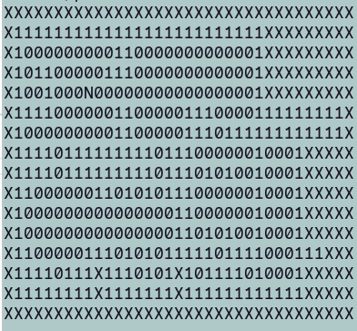
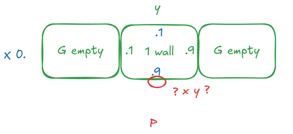

ressources
raycasting : https://lodev.org/cgtutor/raycasting.html
https://www.geeksforgeeks.org/computer-graphics/dda-line-generation-algorithm-computer-graphics/
https://perso.esiee.fr/~buzerl/sphinx_IMA/80%20raycast/raycast.html
IA : correct english for comments in code, search solutions dor raycasting, know directions wall, put textures

Raycasting :

We start to the player position and continue by the initial direction (N/S/W/E) given by the map, unless we meet a wall (1).

The coordonates of wall give it direction, for a ray centered.
here the wall in front of the player : x = 1.9 y = 8.5.
There in double for give precisions

Get direction of wall

so we kmow it s in direction of south